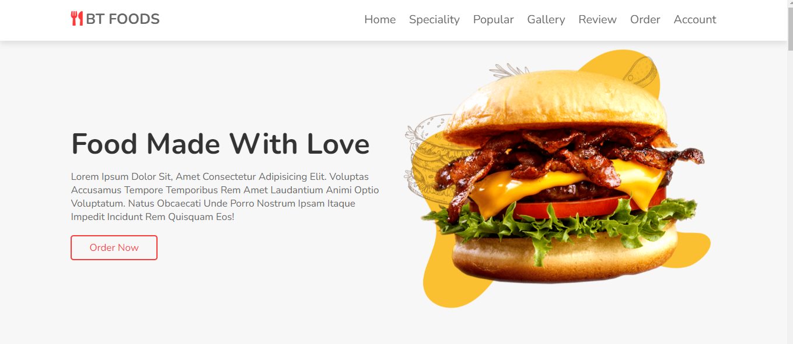
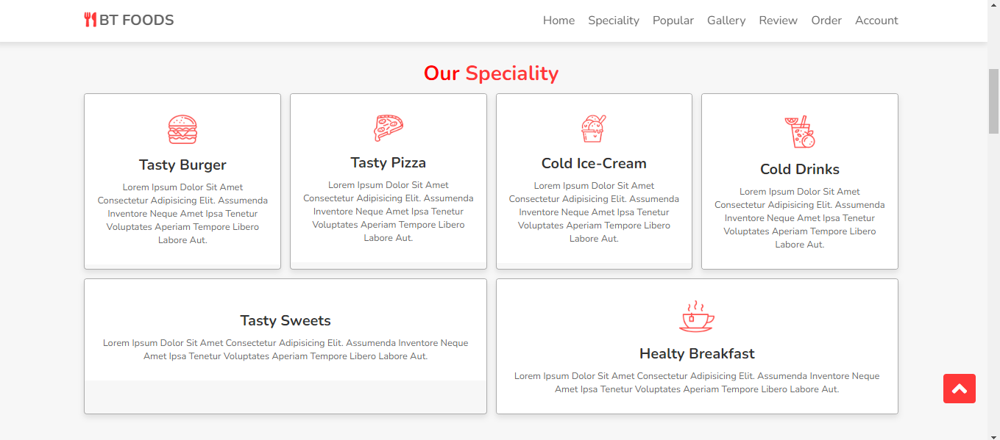
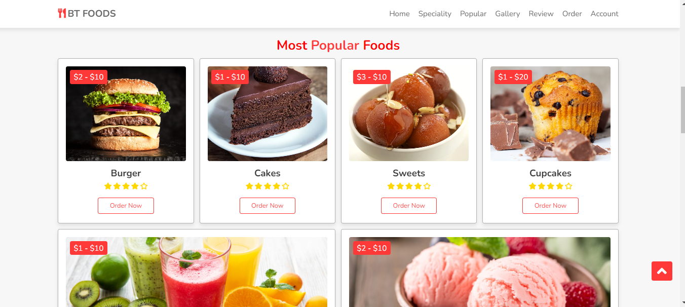
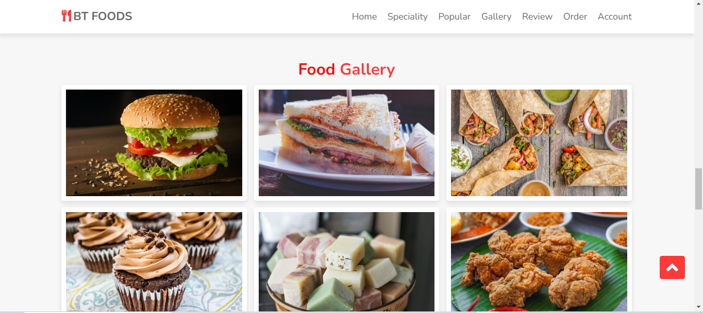
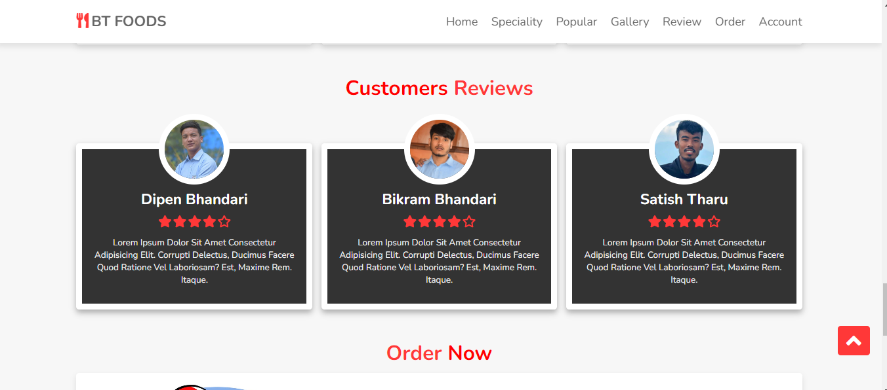
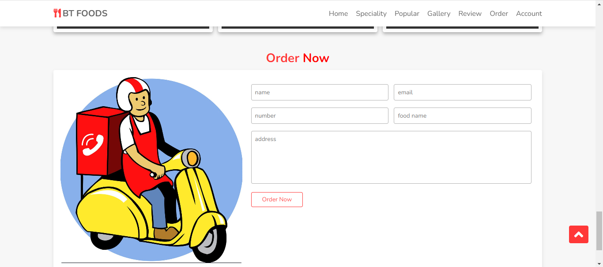

# Youtube BT Solution Hub (https://www.youtube.com/@BT_Solution_Hub)

Free code HTML CSS Javascript and Free learning web developer 

## Image in project

 
 
 
 
 
 
- [Detailed instructions on this project](https://www.youtube.com/@BT_Solution_Hub)

## Follow me for more free codes

- [Website Bikram Bhandari](https://bikramb.netlify.app/)
- [Website BT Book Store](https://btbookstore.netlify.app/)
 - [Youtube BT Solution Hub](https://www.youtube.com/@BT_Solution_Hub)
 - [Facebook Bikram Bhandari](https://www.facebook.com/BikramBhandari01)

## Built By

This project is built and shared by

- BT Solution Hub

## Feedback

If you have any feedback, please reach out to us at btsolutiomhub@gmail.com, Bickybhandari@gmail.com

## Tags

Free code HTML CSS Javascript and Free learning web developer, html code, css code, javascript code tutorial
